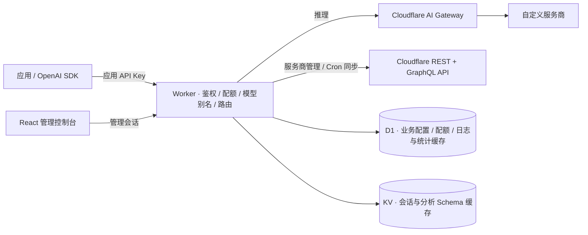

# EdgeGate

[](https://deploy.workers.cloudflare.com/?url=https://github.com/doitcan-oiu/cloudflare-workers-models-gateway)

点击上方按钮即可进入 Cloudflare 部署向导，按提示创建 D1 / KV 并填写 AI Gateway 配置和 Secrets。首次部署所需的 Token 权限与参数见 [Workers 部署指南](./DEPLOYMENT.md)。

基于 **Cloudflare Workers + AI Gateway + D1 + KV** 的大模型网关管理程序。React 19 + HeroUI 3 + Tailwind CSS 4 前端，Hono + TypeScript 后端。功能参考 AxonHub 的统一模型接入场景，目前为单管理员、单工作空间。

**自定义服务商的推理请求全部经过 Cloudflare AI Gateway。** 供应商 API Key 默认由本程序加密保存在 D1，无需配置 BYOK 或 Secrets Store。本程序调用 Cloudflare API 管理服务商，通过 Cron 同步 Cloudflare 日志元数据与 GraphQL 统计到 D1，页面从 D1 读取；费用仍采用 Cloudflare 数据。

部署请阅读 [Workers 部署指南](./DEPLOYMENT.md)，包含 GitHub 自动部署、一键部署按钮、命令行部署和首次配置步骤。

## 职责与架构



| 能力 | 实现位置 |
| --- | --- |
| 自定义服务商注册、查询、修改与删除 | Cloudflare Custom Providers API，账户级资源 |
| 供应商密钥 | 默认 AES-256-GCM 加密保存到 D1，也可引用已有 Cloudflare BYOK 别名 |
| 模型转发、日志采集、缓存、用量与费用数据 | Cloudflare AI Gateway |
| 日志列表与详情 | Cron 同步元数据到 D1，页面本地查询 / 分页 |
| 总览、趋势、模型分布 | Cloudflare GraphQL `aiGatewayRequestsAdaptiveGroups` 快照，D1 缓存 |
| 应用 API Key、模型权限、模型别名、渠道映射、原子配额 | Worker + D1 |
| 管理员会话 | Workers KV |

前端静态资源和 API 由同一个 Worker 提供。管理接口不把 Cloudflare Token、供应商密钥明文或密文返回浏览器。客户端 API Key 仅保存 SHA-256 哈希。供应商密钥和 Cloudflare 渠道的可选 Token 覆盖值使用 AES-256-GCM 加密，密文与渠道 ID 绑定；加密主密钥 `ENCRYPTION_KEY` 保存在 Worker Secret 中。

前端使用 HeroUI 的按钮、输入框、选择器、弹窗、开关、复选框、状态标签及页签，采用中性炭黑背景、深灰卡片与翠绿色强调色，使用顶部导航、流量工作台、渠道资源列表、模型目录与路由详情、密钥权限卡片，以及分组的侧边编辑抽屉。Playground 将对话与参数并列展示，设置页按连接、凭据与接入代码分类。主题变量统一在 `src/styles.css` 中定义；各管理页面按需加载，支持窄屏导航。

## 本地启动

需要 Node.js 22.16+（建议 Node.js 24）和 npm。

```bash
npm ci
npm run setup
npm run dev
```

打开 [本地控制台](http://localhost:5173)。`setup` 在 `.dev.vars` 不存在时生成随机 `ADMIN_TOKEN` 和 `ENCRYPTION_KEY`，以 `0600` 权限保存，并应用本地 D1 迁移。已有文件不会覆盖。

使用 `.dev.vars` 中的 `ADMIN_TOKEN` 登录。没有 Cloudflare 配置时，可管理本地模型、应用密钥等；云端服务商、日志和分析页面会明确提示缺少配置。

安装或升级依赖后，请重启开发服务。如果页面白屏且依赖脚本请求一直处于等待状态，先停止旧的 `npm run dev`，再运行 `npm run dev -- --force` 重建 Vite 依赖缓存并刷新页面。开发端口固定为 `5173`，被占用时会直接报错，避免预览误连到旧进程。

### Cloudflare 配置

1. 在 Cloudflare 创建一个 AI Gateway，开启网关认证并检查日志采集设置。
2. 在 `wrangler.jsonc` 的 `vars` 填写 `CLOUDFLARE_ACCOUNT_ID`（32 位 Account ID）和 `AI_GATEWAY_ID`（网关名称/ID）。
3. 在 `.dev.vars` 添加 `CF_API_TOKEN`。Token 需授权目标账户的 **AI Gateway Read/Edit** 和 **Account Analytics Read**。
4. 确认 `.dev.vars` 中已有有效的 `ENCRYPTION_KEY`，用于加密供应商 API Key。无需创建 Secrets Store 或授予 Secrets Store 权限。
5. 可选：添加独立的 `CF_AIG_TOKEN` 用于推理认证；不配置时使用 `CF_API_TOKEN`，此时它还必须包含 **AI Gateway Run** 权限。独立推理 Token 同样需要 AI Gateway Run 权限。
6. 重启开发服务器。

云端 API 始终连接真实 Cloudflare 账户，即使程序运行在本地。新增服务商会修改云端配置，Playground 会实际调用模型；输入的供应商密钥保存在当前环境的 D1 中。

## 添加自定义服务商与渠道

在「渠道管理」选择「添加渠道」，接入方式默认为「自定义服务商 · AI Gateway」。

- **创建服务商**：填写名称、账户内唯一的 slug、HTTPS Base URL。保存时调用 Cloudflare Custom Providers API。
- **关联已有服务商**：从 Cloudflare 实时列表中选择，支持搜索和分页，不重复创建服务商。
- **设置凭据**：默认选择「程序加密存储」，填写供应商 API Key 即可。编辑时留空保留原密钥，填入新值则替换。已有 Cloudflare BYOK 配置也可选择「使用已有 Cloudflare BYOK 别名」。
- **获取模型清单**：填写 Base URL 和供应商 API Key 后，在「服务商模型清单」点击「从上游获取」。Worker 直接读取上游 `GET /v1/models`（已有 `/v1` 前缀不会重复添加），支持 OpenAI 和 Anthropic 认证及 Anthropic 分页。结果去重后合并到表单，保留手动填写的模型，点击保存才会更新清单，并按渠道的自动路由开关处理同名路由；失败或空清单不会覆盖原内容。最多支持 1000 个模型。编辑渠道时可复用原地址绑定的加密密钥；仅使用 BYOK 时需填写一个不保存的临时 API Key。
- **自动建立同名路由**：渠道表单中的开关默认开启，保存后按模型清单自动建立同名模型与路由。关闭后仅保存清单，已有路由保持不变，可在「模型与路由」手动配置。开关按渠道保存；共享服务商清单更新时，仅同步开启此选项的渠道，重新开启后按当前清单同步。
- **设置请求路径**：请求路径会拼接到供应商的 Base URL 后面。程序使用 Cloudflare 的 Provider Native 自定义端点，不依赖 `/compat` 来转发自定义服务商。

例如供应商的实际 Chat Completions 地址是 `https://api.example.com/v1/chat/completions`：

| Base URL | 请求路径 |
| --- | --- |
| `https://api.example.com` | `v1/chat/completions` |
| `https://api.example.com/v1` | `chat/completions` |

两种设置都可用，不要重复添加 `/v1`。自定义服务商可选择 OpenAI Chat Completions 或 Anthropic Messages 协议。Worker 自动转换两种协议；其他私有协议尚不支持。

实际推理地址：

```text
https://gateway.ai.cloudflare.com/v1/{account}/{gateway}/custom-{slug}/{path}
```

程序加密存储模式下，Worker 解密供应商密钥，根据服务商协议添加认证头：OpenAI 使用 `Authorization: Bearer <供应商 API Key>`，Anthropic 使用 `x-api-key: <供应商 API Key>`。`cf-aig-authorization` 单独携带 Cloudflare 推理 Token。客户端的应用 API Key 不会转发给上游。

使用已有 BYOK 别名时，Worker 改为发送 `cf-aig-byok-alias`，由 AI Gateway 使用其已配置的密钥；本程序不再调用 Secrets Store 或上传 / 修改 BYOK。两种模式互斥，切换为本地加密存储需重新输入供应商 API Key；切换为已有 BYOK 时会清除当前渠道在 D1 中保存的密文。

渠道管理默认只显示渠道列表，协议、标签和模型清单可在渠道表单中直接编辑；这些设置在当前工作空间内由同一服务商的所有关联渠道共享。右上角「Cloudflare 账户资源」是账户级管理的次级入口。修改名称、描述、启用状态会调用 Cloudflare API。为避免将共享凭据转发到其他地址，此页面不允许更改已有服务商的 slug / Base URL；需要变更目的地时新建服务商。删除本地渠道仅删除本地渠道及路由；删除 Cloudflare 服务商会影响账户内所有使用它的网关，界面会提示此影响，并阻止删除仍被本程序渠道使用的服务商。

Cloudflare 与 D1 之间没有跨服务事务。如果服务商已创建但渠道保存失败，错误会给出服务商信息。可以从已有服务商重新关联并填写凭据。密钥不会上传到 Cloudflare 控制 API；推理时会随认证头发送给 AI Gateway。

### 模型与应用接入

在「模型与路由」创建公开模型别名，例如 `smart-chat`，添加路由，选择刚创建的渠道，上游模型 ID 填供应商原始模型名。

在「API 密钥」创建应用密钥，然后设置应用服务端环境变量 `EDGEGATE_API_KEY`：

```bash
curl https://YOUR-WORKER.workers.dev/v1/chat/completions \
  -H "Authorization: Bearer $EDGEGATE_API_KEY" \
  -H "Content-Type: application/json" \
  -d '{"model":"smart-chat","messages":[{"role":"user","content":"你好"}],"stream":true}'
```

支持 `GET /v1/models`、`POST /v1/chat/completions` 和 `POST /v1/messages`，包括 JSON / SSE、文本、图片和工具调用。客户端使用 OpenAI SDK 时把 Base URL 设置为 `https://YOUR-WORKER.workers.dev/v1`。

### 其他保留的渠道

- **Cloudflare AI REST API**：使用 `CF_AI_TOKEN`（Workers AI Read 权限），向 `/accounts/{account}/ai/v1/chat/completions` 发送请求，附带 `cf-aig-gateway-id` 接入 AI Gateway。上游模型使用 `openai/...`、`anthropic/...` 或 `@cf/...` 等账户支持的模型 ID；统一计费需要在 Cloudflare 配置可用余额。
- **AI Gateway 内置模型 / 动态路由**：使用 `CF_AIG_TOKEN` 或 `CF_API_TOKEN`，通过 `/compat/chat/completions` 调用已配置 BYOK 的内置模型或 `dynamic/{route-name}`。Cloudflare 已将普通单模型兼容端点标记为弃用，动态路由仍使用它。

初始化预置的三个模型和 Cloudflare 渠道只是可编辑示例，不保证你的账户具备相应模型权限。主要使用自定义服务商时可停用示例路由。

## 服务商协议与双向转换

自定义服务商的「服务商协议」决定其上游请求格式；客户端调用的端点决定客户端协议。转换按每条路由独立完成，故障转移切换协议时始终从原始请求重新转换。

| 客户端端点 | 服务商协议 | 行为 |
| --- | --- | --- |
| `/v1/chat/completions` | OpenAI | 同协议透传 |
| `/v1/chat/completions` | Anthropic | OpenAI 请求 → Messages；响应 / SSE → OpenAI |
| `/v1/messages` | Anthropic | 同协议透传，转发版本与 Beta 请求头 |
| `/v1/messages` | OpenAI | Messages 请求 → Chat Completions；响应 / SSE → Anthropic |

Anthropic 服务商常用路径是 `v1/messages`（Base URL 已包含 `/v1` 时填 `messages`），OpenAI 为 `v1/chat/completions`。在渠道或服务商表单中切换协议会自动调整关联渠道的这些标准路径，特殊自定义路径需在渠道中手动调整。

两种端点均接受应用 `Authorization: Bearer eg_…` 或 `x-api-key: eg_…`。客户端的凭据不会转发给供应商，Cloudflare 认证和供应商认证由服务端独立设置。Anthropic 请求示例：

```bash
curl https://YOUR-WORKER.workers.dev/v1/messages \
  -H "x-api-key: $EDGEGATE_API_KEY" \
  -H "anthropic-version: 2023-06-01" \
  -H "Content-Type: application/json" \
  -d '{"model":"claude-sonnet-4-5","max_tokens":1024,"messages":[{"role":"user","content":"你好"}],"stream":true}'
```

转换覆盖 system / developer、文本、图片 URL / Base64、客户端 function / tool_use、工具结果、工具选择、停止原因及上游用量。Anthropic 错误工具结果转换为保留 `is_error` 和内容的 JSON 文本。SSE 逐事件转换，保持背压和取消传播，支持分片 UTF-8、多个工具和分片 JSON 参数；异常结束输出错误事件，不伪造正常结束事件。

协议存在差异，当前边界如下：

- 同协议请求保留原协议扩展。跨协议不支持的参数（如扩展 thinking、提示缓存控制、服务端工具、音频、JSON response_format、多候选 `n > 1`、Anthropic `top_k`）返回明确的 `unsupported_conversion`。存在同协议可用路由时可跳过无法转换的候选。
- OpenAI → Anthropic 未指定输出长度时使用 `max_tokens=4096`；Anthropic 的温度范围要求为 0–1，程序不悄悄截断超出范围的温度。实际模型仍可能有更严格要求。
- Anthropic 客户端调用 OpenAI 服务商时，流式请求会向上游请求 `include_usage`。Anthropic 的初始流式计数从 0 开始，结束事件更新为上游报告值；若上游缺少必要用量、缺少结束事件或出现无法表示的内容，转换会报错。不会自行补算用量或账单；后台仍会同步 Cloudflare 实际报告的记录。
- 供应商认证按上游协议选择：OpenAI 使用 Bearer，Anthropic 使用 `x-api-key`。故障转移时按候选渠道重新选择密钥和认证头。其他私有认证方式尚不支持；已有 BYOK 模式使用 Cloudflare 对应的凭据配置。

## 服务商标签与模型并集

创建服务商或创建新服务商渠道时，可以填写协议、标签和模型清单。已有服务商可直接在渠道表单中编辑，也可通过「Cloudflare 账户资源」入口编辑。它们是 EdgeGate 的业务配置，保存在 D1，并关联 Cloudflare provider ID；不会伪装成 Cloudflare 原生标签参数。

模型清单支持输入模型 ID 后回车添加标签，也可粘贴多行或逗号分隔内容。开启「自动建立同名路由」的渠道会注册同名公开模型与路由，关闭时只保存清单；多个渠道、多个服务商共享同一公开模型时，模型列表去重，所有符合权限的路由都保留。已有自定义模型别名继续有效。

创建 API Key 时可选择服务商标签，规则如下：

1. 未选择标签：不限制服务商标签，包括无标签服务商。
2. 选择一个或多个标签：服务商只需匹配其中任意一个（OR）。无标签服务商不在这个范围内。标签区分大小写，并去重。
3. `/v1/models` 返回符合标签范围、拥有已启用且已配置渠道路由的公开模型的**并集**，再与 Key 的可选模型白名单取交集。
4. 标签限制同时应用于两种推理端点和每次故障转移；不能通过同名模型、请求参数或备用路由越过权限。
5. 新增服务商或修改标签后，已有 Key 的模型范围随之变化，不需要重新签发 Key。权限查询不使用 KV 缓存。

例如：

| 服务商 | 协议 | 标签 | 模型清单 |
| --- | --- | --- | --- |
| A | Anthropic | `claude` | `claude-sonnet-4-5` |
| B | OpenAI | `claude` | `claude-opus-4-6` |
| C | OpenAI | `private` | `private-model` |

只选择 `claude` 标签且未限制模型白名单的 Key，调用 `/v1/models` 得到：

```json
{
  "object": "list",
  "data": [
    { "id": "claude-opus-4-6", "object": "model", "owned_by": "edgegate" },
    { "id": "claude-sonnet-4-5", "object": "model", "owned_by": "edgegate" }
  ]
}
```

以上省略了实际响应中的 `created` 时间戳。两个模型都能通过任一协议端点调用；不会暴露 C 的模型。模型清单由管理员配置，不会自动爬取供应商的全量模型目录。

「模型与路由」通过平铺的标签按钮切换管理范围，默认选中第一个可用标签；模型目录、路由数量、路由列表和可选渠道同步限定到该范围。相同模型 ID 在多个标签下复用全局模型，实际路由仍属于各自渠道。标签视图可为已有模型添加路由；新模型可在渠道模型清单中添加，并启用自动建立同名路由。一个渠道有多个标签时，其路由在多个视图中共享，修改会影响这些标签。无标签渠道可通过「未打标签」管理。管理 API 的 `/models`、`/routes` 支持 `?tag=标签` 或 `?untagged=1`；带范围的路由写入会校验原路由和目标渠道，模型全局写入不接受标签范围。

修改清单只删除该清单管理的自动路由，保留手工配置的模型别名；编辑自动路由后，该路由转为手工管理。没有可用路由的模型不会出现在 `/v1/models` 中。全局模型元数据仍可通过不带标签范围的管理 API 维护，页面只管理所选标签的路由。

Playground 同样通过标签按钮选择调试范围，只列出该范围中已配置、已启用渠道的可用模型。请求、重新生成及故障重试都限定在所选标签内；切换标签保留对话和草稿，每条回复标明发起时的标签。调用代码仍使用应用 API Key 的标签授权：仅授权当前标签可复现相同渠道范围，API Key 暂不支持仅授权未打标签渠道。

升级时执行 `npm run db:migrate`（生产使用 `npm run db:migrate:remote`），应用 `0003_protocols_and_tags.sql`。旧服务商默认 OpenAI 协议、无标签；已有 API Key 默认不限制标签，原有模型白名单继续生效。

## 日志与分析

数据来源仍是 Cloudflare AI Gateway，由 Worker Cron 定时同步到 D1。网页、日志分页 / 筛选 / 详情、总览刷新不再直接请求 CF 控制接口。

| 内容 | 同步频率 / 保留 |
| --- | --- |
| 最近 5 分钟日志 | 每 2 分钟，优先最新记录 |
| 最近 2 小时日志复查 | 每 15 分钟，更新长 SSE 等延迟数据 |
| 24 小时 / 7 天统计快照 | 每 5 / 15 分钟 |
| 历史日志 | 按 6 小时时间段分批回补，补完后持续填补缺口，并每天安排历史复查 |
| 日志保留期 | 默认 7 天，可在「网关设置 → 数据同步」切换 30 天 |

- Cron 每分钟检查到期任务，不需要保持网页或电脑开启。每类任务使用 D1 原子租约，单轮有页数及时间预算；未完成的进度下一轮继续。高流量或 CF 接口慢时，同步会滞后，页面显示成功时间和状态。
- 「立即同步」通过 `POST /api/observability/sync` 将请求持久化到 D1，在下一分钟的 Cron 开始；重复点击会合并。任务不依赖 HTTP 请求结束后的 `waitUntil` 寿命。`GET /api/observability` 读取同步进度，`PUT /api/config/observability` 设置日志保留期。
- 日志以 Cloudflare log ID 去重更新，不以 EdgeGate request ID 合并重试。分页固定时间边界并重叠重读，保存元数据与页进度的操作为原子批次；较早发出但较晚返回的同步结果不能覆盖更新的观察值。CF API 没有稳定快照游标或明确的入库延迟保证，重读降低漏记风险，不能恢复 CF 未采集、已删除的记录。
- 渠道卡片显示最近 1 小时的分段可用率，共 30 块，每块代表 2 分钟。`GET /api/channels/availability` 按日志中的渠道 ID 从 D1 汇总成功率，同名渠道互不混用；缓存命中、缺少成功状态或渠道 ID 的记录不参与统计。重试按各次上游尝试计算，灰色表示无有效样本。这是已同步请求的成功率，不是主动探测在线率；同步延迟和历史回补会单独标示。升级前缓存中缺少渠道 ID 的记录需等待后台重新同步后才会计入。
- 本地只缓存列表与现有详情需要的元数据，不复制请求 / 响应正文、认证头。缺失的状态、Token 或费用显示「未报告」或 `—`。本地总条数、筛选和分页只针对已同步且在保留期内的记录；可以查看最早记录及历史回补进度。
- 统计来自 GraphQL 的整个网关聚合，不以本地日志条数补算请求量、用量和费用。快照保留自身的起止时间，图表按该时间窗口绘制，过期快照不会把尚未同步的时段画成 0。
- 同步失败保留最后成功的快照与日志；首次没有快照时显示等待同步及错误，不伪造零流量。数据按 Account / Gateway 隔离，Token 轮换保留同一资源的缓存。KV 仅用于会话及分析 Schema 字段缓存。
- 保留期缩短后立即按新范围查询，Cron 分批清理过期行；再次延长会重新回补，并撤销旧日志任务租约，避免过时进度覆盖新范围。保留更多日志会增加 D1 存储、写入与 CF 读取次数，请根据请求量选择。

- 范围为当前 AI Gateway 的全部调用，包含其他客户端。一次 EdgeGate 请求发生故障转移时，可能生成多条 Cloudflare 日志。
- 通过 `cf-aig-metadata` 传递请求 ID、应用 Key ID/名称、模型别名、渠道与尝试序号。返回 `X-Request-ID`、`X-Gateway-Attempts`，以及上游提供的 `cf-aig-log-id`，便于关联。
- Worker 不再强制关闭 AI Gateway 日志或缓存。正文是否采集、日志保留期限、缓存和 Custom costs 由 Cloudflare 网关设置决定。完整请求/响应正文目前在 Cloudflare 控制台查看。
- Cloudflare 分析可能延迟或采样，部分自定义服务商无法自动提供 Token / 成本；本程序不会自行补算。需要补充单价时在 Cloudflare 配置 Custom costs。
- 「请求日志 → 请求追踪」可按响应中的 `X-Request-ID` 查询每次失败的原始错误；普通响应、流式错误与连接失败均会记录。追踪只对管理员开放，保留 7 天，每条最多 16 KiB，超长或未完整读取会标记截断。Cloudflare 日志详情也会关联对应的原始错误。客户端错误展示设置不影响这些记录。
- Worker 提前拒绝的鉴权、配额或路由错误没有到达 AI Gateway，因此不会出现在 AI Gateway 推理日志或上游错误追踪中。Worker 自身运行异常仍可通过 Cloudflare Workers Observability 排查。

## 升级旧版直连配置

```bash
npm run db:migrate          # 本地
# 正式部署前，对生产 D1 执行：
npm run db:migrate:remote
```

`0002_ai_gateway_control_plane.sql` 为渠道增加 Cloudflare 服务商 ID、slug、请求路径、BYOK 别名。保留原模型、应用密钥、配额与历史 `request_logs` 表；旧日志不会删除，但新程序不再读写该表或运行日志清理任务。`0004_gateway_settings.sql` 新增程序设置与上游错误追踪表。`0005_channel_auto_routes.sql` 新增渠道自动路由开关，现有渠道默认开启。`0006_long_channel_timeout.sql` 将渠道超时上限放宽到 3600 秒，保留现有渠道、密钥和路由。`0007_observability_cache.sql` 新增日志元数据、统计快照、同步状态和保留期配置表，不修改历史业务数据。Cron 每分钟调度同步并清理过期缓存，原配额与 7 天错误追踪的清理仍在每天 UTC 03:15 执行。

旧「OpenAI 兼容」直连渠道会显示待配置，**不会继续直连供应商**。编辑渠道，将其关联到 Cloudflare 服务商，并确认请求路径。仅当完整上游 URL 与旧地址完全一致时，才会保留原有加密 Key；目的地不一致需重新输入密钥或提供已有 BYOK 别名。关联后推理经过 AI Gateway，密钥继续加密保存在 D1。

### 从 BYOK 版本升级

现有 BYOK 渠道继续使用原别名，不需要重新创建。要改为程序加密存储，编辑渠道，选择「程序加密存储」，重新输入供应商 API Key 并保存。Cloudflare 中原有的 BYOK 配置不会被删除。本次存储方式变更复用已有 `secret_encrypted` 列，无需新增数据库迁移。

新版一键部署已移除 `SECRETS_STORE_ID`，旧环境里的同名变量可删除。`CF_API_TOKEN` 不再需要 Secrets Store 权限。后续部署必须保留原来的 `ENCRYPTION_KEY`；更换主密钥前应重新配置所有使用旧密钥加密的凭据。

## 部署

完整步骤见 [Workers 部署指南](./DEPLOYMENT.md)。支持连接 GitHub 仓库交给 Workers Builds 构建，也可在公开仓库添加 Deploy to Cloudflare 按钮。

配置好生产 D1 / KV、AI Gateway 和运行时 Secrets 后，本地更新部署使用：

```bash
npm run check
npm run deploy
```

`deploy` 会依次构建、应用远程 D1 增量迁移、发布 Worker。Workers Builds 的 Build command 填 `npm run build`，Deploy command 填 `npm run deploy:ci`，避免重复构建。迁移通过 `DB` 绑定定位数据库，允许一键部署时重命名 D1。

本地与生产 D1 / KV 相互独立，本地渠道与应用 Key 不自动上传；若使用同一 Account / Gateway，则 Cloudflare 服务商、BYOK 和日志是共享的。`.dev.vars` 仅供本地使用，不会随部署上传。

## 路由与配额

在「网关设置 → 程序设置」配置负载均衡、重试与错误展示。设置保存在 D1，保存后对新请求生效，进行中的请求使用开始时的配置。

- 负载均衡：始终优先选择较低优先级。同级支持「多渠道随机」（不同渠道等概率）或「按照权重」（按路由权重抽样）；同一渠道的多条路由不会被重复视为新渠道。
- 单渠道重试 0–5 次，跨渠道重试 0–10 次，均不包含首次请求。默认按权重、单渠道重试 0 次、跨渠道重试 4 次。最多尝试 `(单渠道重试 + 1) × (跨渠道重试 + 1)` 次，并受可用渠道数限制。每次尝试按该渠道配置的总超时独立计时，不再使用固定的 180 秒总时限。
- 408、409、429、5xx、连接失败或无效响应可先在当前渠道重试，短暂递增退避后再发起请求；当前渠道耗尽次数再切换。401、403、404 直接切换到不同渠道，一般参数错误不重试。单次上游请求的总超时可设置为 1–3600 秒（默认 60 秒），涵盖响应头及完整响应体，包括 SSE 全程，不是首字或空闲超时。长流式请求可设置 1200 秒（20 分钟）或 1800 秒（30 分钟），开始输出 SSE 后不再重试。断连或重试仍可能产生上游费用。
- 此超时只控制 EdgeGate 的上游请求。Cloudflare AI Gateway 的 [请求超时](https://developers.cloudflare.com/ai-gateway/configuration/request-handling/) 按响应首部分到达计时；客户端 SDK、反向代理和供应商仍可能有独立时限。
- 上游错误展示支持显示原始错误、隐藏细节（默认）和自定义提示，涵盖 OpenAI / Anthropic 普通及流式响应。自定义规则优先精确匹配供应商错误码（含数字码），其次匹配上游 HTTP 状态码，再匹配网关上游错误类别（例如 `upstream_timeout`）；未匹配时隐藏细节。规则只改变对外提示，不改变 HTTP 状态、路由或重试判定。
- 管理接口：`GET /api/config` 返回 `runtime` 配置；`PUT /api/config/runtime` 完整更新配置，校验取值范围和重复错误码。`GET /api/traces/{request-id}` 查询管理员错误追踪。

D1 通过原子条件更新执行每个应用 Key 的每分钟 / 每日请求限额，使用 UTC 固定窗口；授权且格式有效的请求在路由前消耗一次配额，重试不重复计数。撤销立即影响后续鉴权，进行中的请求继续完成。KV 会话单独退出的跨区域传播受最终一致性影响，并有显式 24 小时到期限制。

## 工程与验证

```text
src/                    React 管理界面
worker/
  index.ts              路由入口、错误处理、配额清理
  auth.ts               管理会话、应用 API Key 鉴权
  admin.ts              业务配置管理
  channels.ts           Cloudflare 服务商与本地渠道映射
  cloudflare.ts          Cloudflare REST / GraphQL 客户端
  observability.ts       日志与统计的 D1 查询接口
  observability-sync.ts  Cron 同步、分页水位与日志清理
  observability-store.ts 同步状态、保留期与手动任务请求
  cloudflare-observability.ts Cloudflare 日志与 GraphQL 读取
  gateway.ts            应用配额、故障转移与 SSE 透传
  upstream.ts           AI Gateway 端点与标签范围内的路由选择
  providers.ts          协议、标签、模型清单与自动路由
  protocols/            OpenAI / Anthropic 请求、响应与 SSE 转换
migrations/             D1 增量迁移
scripts/setup-local.mjs 本地随机密钥生成
tests/gateway.test.ts   workerd / Miniflare 接口测试
wrangler.jsonc          Worker 静态资源、D1 / KV、环境配置
```

```bash
npm run typecheck
npm test
npm run build
npm run check
npm audit
npx wrangler deploy --dry-run
```

测试在隔离的 D1 / KV 中运行，模拟 Cloudflare 控制 API 和推理响应，并禁止供应商直连及 Secrets Store 操作。覆盖真实 Worker 运行时中的鉴权、并发配额、服务商管理、密钥加密与轮换、旧 BYOK 兼容、升级、跨协议认证与故障转移、SSE、日志分页和 GraphQL 聚合。测试不调用真实供应商；未提供账户凭据时无法完成云端联调。

当前未实现多租户 / RBAC、充值或硬金额预算、Responses、embeddings、图像 / 音频接口、熔断与长期健康探测。前端同源访问；管理 / Playground 请求体上限 256 KiB，推理请求体 2 MiB，非流式上游响应 8 MiB。

## 官方参考

- [Custom Providers API 与推理地址](https://developers.cloudflare.com/ai-gateway/configuration/custom-providers/)
- [已有 BYOK 配置](https://developers.cloudflare.com/ai-gateway/configuration/bring-your-own-keys/)
- [AI Gateway Logs API](https://developers.cloudflare.com/api/resources/ai_gateway/subresources/logs/methods/list/)
- [AI Gateway GraphQL Analytics](https://developers.cloudflare.com/ai-gateway/observability/analytics/)
- [Cloudflare AI REST API](https://developers.cloudflare.com/ai-gateway/usage/rest-api/)
- [AI Gateway 兼容端点与动态路由](https://developers.cloudflare.com/ai-gateway/usage/chat-completion/)

- [OpenAI Chat Completions API](https://developers.openai.com/api/reference/resources/chat/subresources/completions/methods/create)
- [Anthropic Messages API](https://platform.claude.com/docs/en/api/messages/create)
- [Anthropic SSE 事件格式](https://platform.claude.com/docs/en/build-with-claude/streaming)
